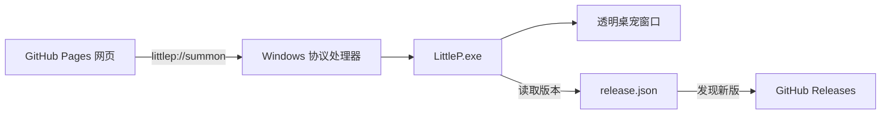

<p align="center">
  
</p>

<h1 align="center">Little P</h1>

<p align="center">有 32 种表情的网页角色与 Windows 桌面伙伴。</p>

<p align="center">
  <a href="https://haonanyu123.github.io/little-p/">在线体验</a> ·
  <a href="https://github.com/HaonanYu123/little-p/releases/latest">下载 Windows 桌宠</a> ·
  <a href="THIRD_PARTY_NOTICES.md">许可说明</a>
</p>

<p align="center">
  <a href="https://github.com/HaonanYu123/little-p/actions/workflows/pages.yml"></a>
  <a href="https://github.com/HaonanYu123/little-p/actions/workflows/checks.yml"></a>
  <a href="https://github.com/HaonanYu123/little-p/releases"></a>
</p>

## 体验

网页中可以切换经典小 P 和蝴蝶结小 P，浏览 32 种表情，使用自动播放、线稿、中英文和明暗主题。安装 Windows 桌宠后，在在线网页点击“召唤”，小 P 会通过 `littlep://` 协议出现在桌面。

> [!IMPORTANT]
> GitHub Pages 本身不能直接启动电脑程序。第一次使用“召唤”前，需要从 Releases 安装 Windows 桌宠。浏览器第一次打开 `littlep://` 时可能会请求确认。

## 功能

| 网页 | Windows 桌宠 | 发布与更新 |
| --- | --- | --- |
| 两种造型、32 种表情 | 155 × 155 透明置顶窗口 | GitHub Pages 自动部署 |
| 点击放大、自动巡演 | 拖动、点击、滚轮互动 | `littlep://summon` 协议召唤 |
| 线稿、明暗主题、中英文 | 右键表情面板 | GitHub Releases 安装包 |
| 桌面与手机尺寸适配 | 网页状态同步到桌面 | 静态 `release.json` 版本检查 |

## 安装和使用

1. 从 [最新 Release](https://github.com/HaonanYu123/little-p/releases/latest) 下载 `LittleP-Setup.exe`。
2. 完成 Windows 安装。安装器会创建快捷方式并注册 `littlep://`。
3. 打开[在线网页](https://haonanyu123.github.io/little-p/)，选择造型和表情，点击“召唤”。
4. 拖动小 P 移动，滚轮切换表情，右键打开完整表情面板。

## 工作方式



网页更新后，访问者刷新即可获得新版本。已经安装的桌宠不会随网页文件自动替换；桌宠启动时读取 GitHub Pages 上的 `release.json`，发现新版后提示下载，因此不需要数据库或独立后端。

## 本地开发

需要 Windows 和 Python 3.9 或更新版本。双击 `start.bat`，脚本会选择具备桌宠组件的 Python；缺少组件时自动安装。浏览器随后打开 <http://127.0.0.1:8086/>。

```powershell
# 浏览器回归检查
npm install --prefix output/qa-tools --no-package-lock --no-save --ignore-scripts playwright node-win-x64@22
& './output/qa-tools/node_modules/node-win-x64/bin/node.exe' scripts/verify.cjs

# 桌宠面板检查
python scripts/verify-desktop-menu.py
```

运行 `build-windows.bat` 可生成便携目录和 Inno Setup 安装包。安装包默认写入 Program Files，以兼容 QtWebEngine 对包含中文字符路径的限制。

## 项目结构

| 路径 | 用途 |
| --- | --- |
| `index.html`、`site/` | 网页界面、交互和发布配置 |
| `engine/` | 共享表情引擎和 32 种状态数据 |
| `desktop/` | Windows 透明桌宠与右键面板 |
| `littlep_app.py` | 安装版入口、协议处理和更新检查 |
| `serve.py`、`desktop_host.py` | 本地开发服务与召唤桥 |
| `LittleP.spec`、`installer/` | PyInstaller 与 Inno Setup 配置 |
| `.github/workflows/` | 自动检查和 GitHub Pages 部署 |

贡献指南见 [CONTRIBUTING.md](CONTRIBUTING.md)，安全设计见 [SECURITY.md](SECURITY.md)。

## 许可

本仓库新增原创内容采用 [MIT License](LICENSE)。项目同时包含受非商业社区许可约束的继承代码和素材，公开分发时必须保留其许可与版权声明；MIT 许可不覆盖这些继承内容。请在使用或再分发前阅读 [THIRD_PARTY_NOTICES.md](THIRD_PARTY_NOTICES.md) 及 `licenses/upstream/` 中的完整条款。

若计划用于商业产品、商业推广或付费服务，请先确认并取得相关上游授权。
